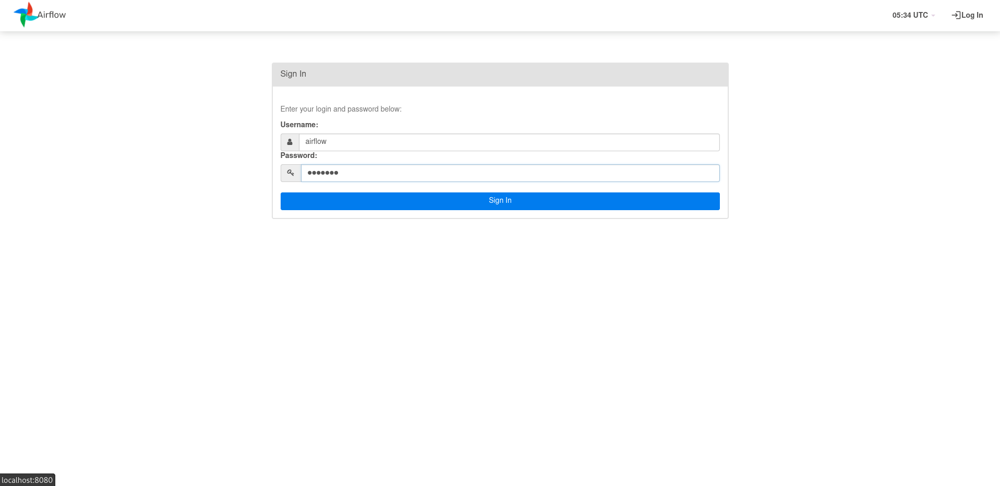

# Airflow-Test

Para correr este repositorio podemos levantar el docker compose entro de este repo con el siguiente comando
```Bash
docker-compose up --build  
```
El usuario y constraseña es airflow y airflow.

Activamos el DAG.

Podemos observar el grafo en la sig imagen.

